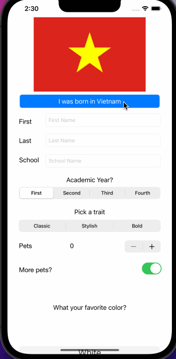

## Hello app

### App Description

Hello app is an app that allow user to introduce themselves through their inputs. 

### App Walk-though

### Required Features

- [X] 1. App displays an image of a school's logo
- [X] 2. App has three textfields for first, last, and school names
- [X] 3. App has a segmented control that changes student year
- [X] 4. Number of pet matches label is increased/decreased by stepper
- [X] 5. Switch makes a statement about wanting more pets or not(true/false) 
- [X] 6. Introduce yourself button shows alert box with an introduciton and dismiss button

### Optional Features

- [X] 1. User can tap a button to change the color of the background view
- [X] 3. User can select on additional buttons that provide more info about the user. Example: more textfields, a different alert box, etc.
- [X] 4. Any stylistic changes that are not default options (incorporate a scrollview, change picture programmatically with a button, design a custom popUp, used UserDefaults to save data)
